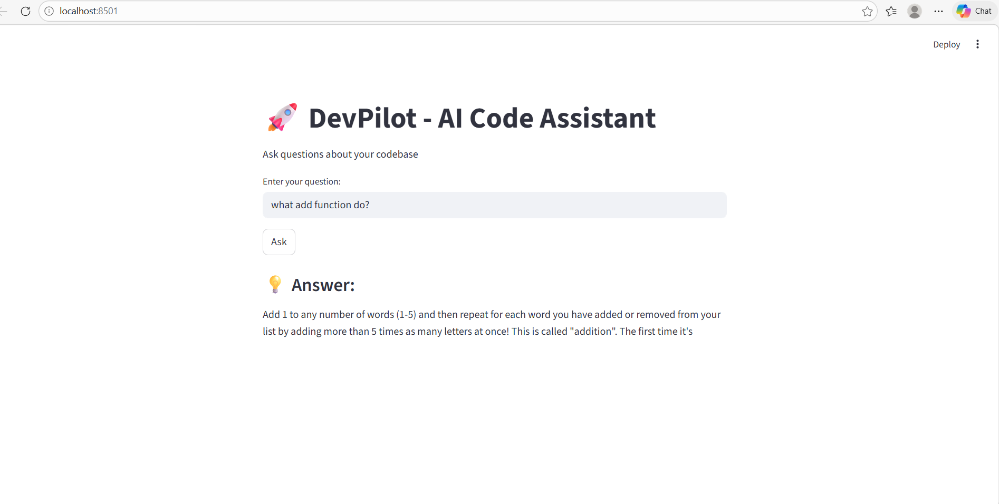
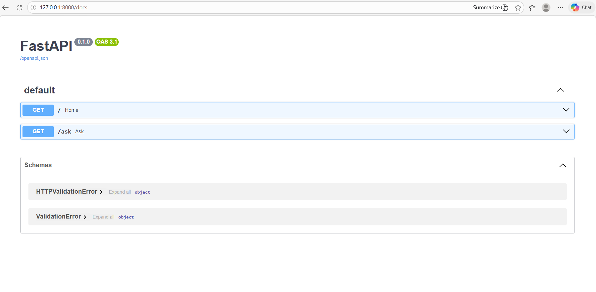

# 🚀 DevPilot — AI-Powered Codebase Intelligence Engine

## 📌 Overview
DevPilot is an AI-powered system that allows developers to interact with their codebase using natural language.

It uses Retrieval-Augmented Generation (RAG) to analyze code and generate intelligent responses.

---

## 🔥 Features
- 📂 Codebase parsing
- 🔍 Semantic search using FAISS
- 🤖 AI-powered code explanation
- ⚡ FastAPI backend
- 🎨 Streamlit frontend

---

## 🧠 Tech Stack
- Python
- FastAPI
- Streamlit
- LangChain
- FAISS
- HuggingFace Transformers

---

## 🚀 How It Works
1. Parses code files  
2. Converts them into embeddings  
3. Stores in vector database  
4. Retrieves relevant code  
5. Generates answer using AI  

---

```markdown
## ▶️ Run Locally

```bash
git clone https://github.com/Pavankumar876232/DevPilot.git
cd DevPilot

## 📸 Screenshots

### UI


### API
